# Single Stage Common Object Detection

Official Pytorch implementation for the paper **"Single Stage Class Agnostic Common Object Detection"**.
This work is based on [MMDetection](https://github.com/open-mmlab/mmdetection) 1.1.0.


## Installation

```bash
conda env create -f environment.yml -n sscod
conda activate sscod

pip install "git+https://github.com/cocodataset/cocoapi.git#subdirectory=PythonAPI"
pip install -v -e .
```


## Training and Testing

Scripts for training and testing models are put in folder `scripts`:
```
scripts
├── coco
│   ├── test
│   │   ├── exp2_caseA_baseline.sh
│   │   ├── exp2_caseB_baseline.sh
│   │   └── exp2_caseB_curcon.sh
│   └── train
│       ├── exp2_caseA_baseline.sh
│       ├── exp2_caseB_baseline.sh
│       └── exp2_caseB_curcon.sh
└── voc
    ├── test
    │   ├── exp2_arcconneg.sh
    │   ├── exp2_arccon.sh
    │   ├── exp2_baseline.sh
    │   ├── exp2_curcon.sh
    │   └── exp2_focalcur.sh
    └── train
        ├── exp2_arcconneg.sh
        ├── exp2_arccon.sh
        ├── exp2_baseline.sh
        ├── exp2_curcon.sh
        └── exp2_focalcur.sh
```


## Quantitative results

#### VOC dataset

<p align="center">
    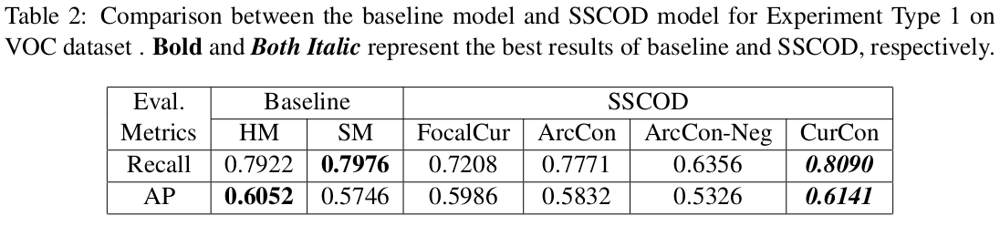
</p>

<p align="center">
    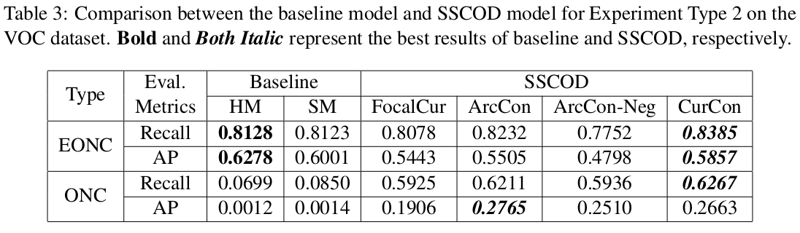
</p>

<p align="center">
    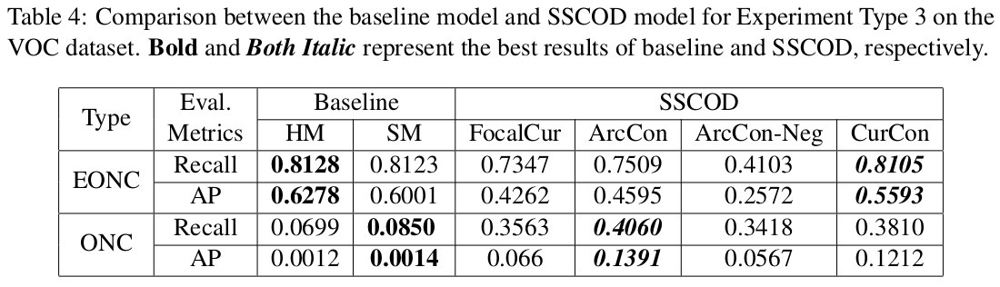
</p>


#### COCO dataset

<p align="center">
    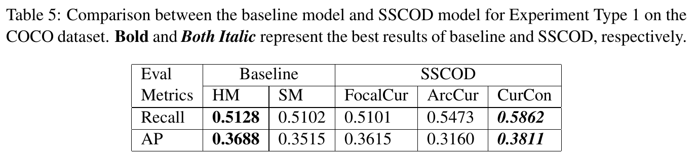
</p>
<p align="center">
    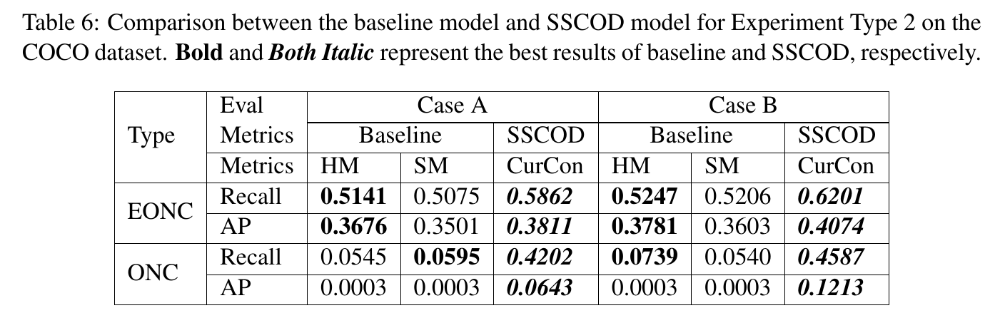
</p>


## Qualitative results

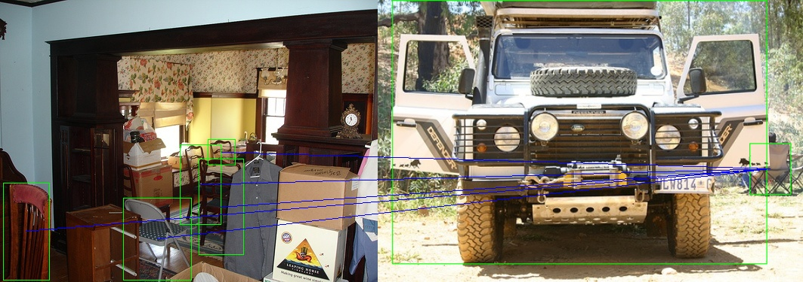
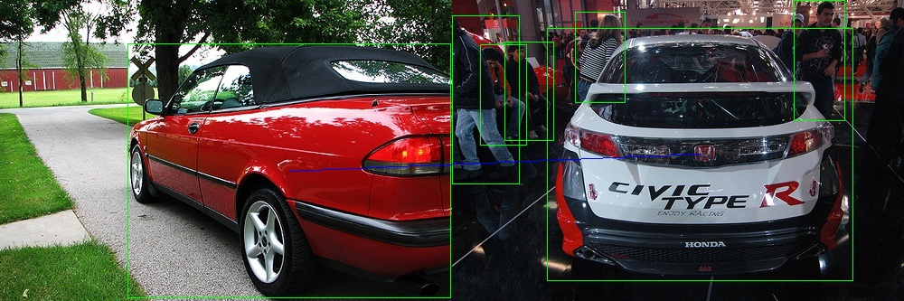
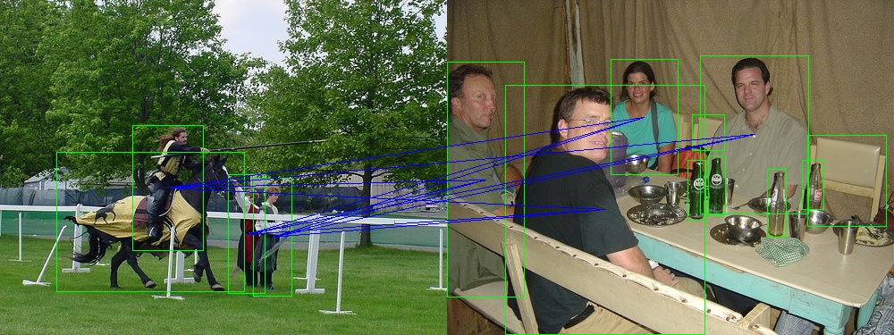
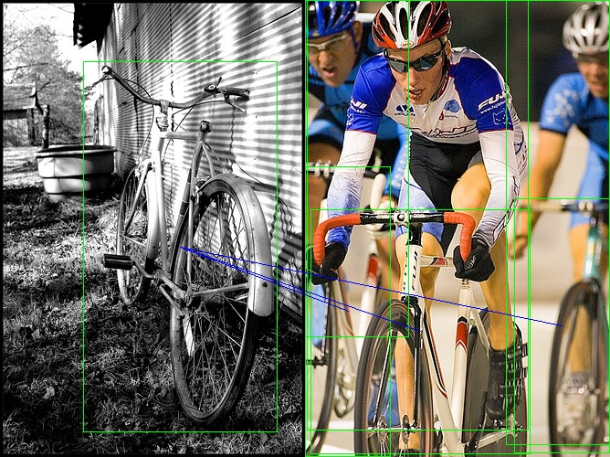
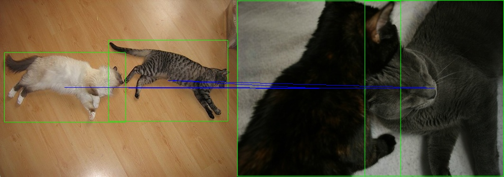
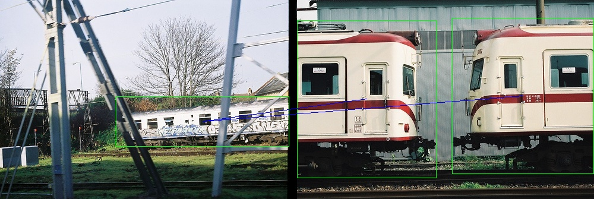
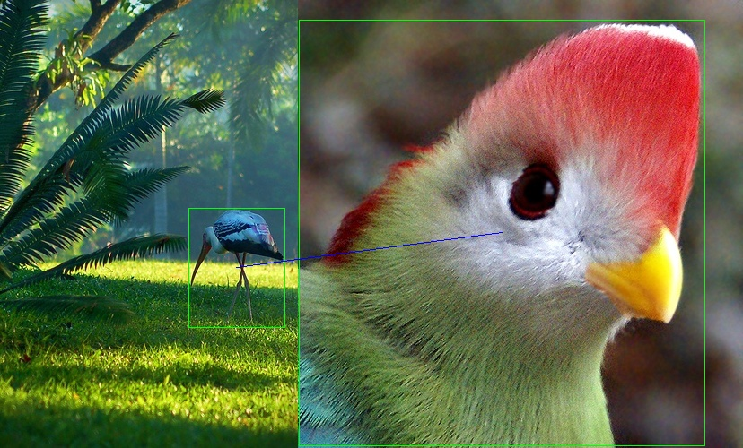
